# UTIpmiTool 项目详细设计说明书

## 文档信息

| 项目         | 值               |
|--------------|------------------|
| **项目名称** | UTIpmiTool       |
| **版本号**   | V1.0             |
| **编制部门** | 系统软件部       |
| **编制人**   | 系统开发团队     |
| **日期**     | 2024年12月      |

## 修订记录

| 序号 | 版本号 | 修订内容描述 | 修订日期    | 修订人     |
|------|--------|--------------|-------------|------------|
| 1    | V1.0   | 新建         | 2024年12月  | 开发团队   |

## 目录

1. [概述](#1-概述)
2. [模块设计](#2-模块设计)
3. [全局数据结构设计](#3-全局数据结构设计)
4. [安全风险分析](#4-安全风险分析)
5. [人机交互设计](#5-人机交互设计)
6. [部署方案](#6-部署方案)

## 1 概述

### 1.1 目的

本文档是针对 UTIpmiTool 系统给出的系统详细设计文档。UTIpmiTool 是一个用 Rust 重新实现的 IPMI (Intelligent Platform Management Interface) 管理工具，旨在提供安全、高效、跨平台的 BMC (Baseboard Management Controller) 管理功能。

本文档将给出 UTIpmiTool 系统的系统设计原则、关键静态结构设计、关键动态流程设计、数据结构设计、人机交互设计、非功能性设计、系统部署与实施设计等内容。

本文档的适用读者为 UTIpmiTool 系统的产品经理、设计人员、开发人员、测试人员以及后续维护人员。

### 1.2 术语说明

- **IPMI**: Intelligent Platform Management Interface，智能平台管理接口，是一种开放标准的硬件管理接口规范
- **BMC**: Baseboard Management Controller，基板管理控制器，是服务器主板上的一个独立处理器
- **SDR**: Sensor Data Record，传感器数据记录，用于描述传感器信息的数据结构
- **SEL**: System Event Log，系统事件日志，记录系统硬件事件的日志系统
- **LUN**: Logical Unit Number，逻辑单元号，用于在 IPMI 中寻址不同的逻辑设备
- **IPMB**: Intelligent Platform Management Bus，智能平台管理总线
- **OEM**: Original Equipment Manufacturer，原始设备制造商
- **CLI**: Command Line Interface，命令行接口

### 1.3 参考资料

- IPMI v2.0 规范文档
- Rust 编程语言官方文档
- 统信 UOS 系统开发规范
- 项目编码规范文档

## 2 模块设计

### 2.1 设计约束

本项目遵循以下设计约束和原则：

- **编程语言**: 使用 Rust 1.85+ 版本，确保内存安全和并发安全
- **构建工具**: 使用 Cargo 作为主要构建工具，支持 RPM 包构建
- **目标平台**: 主要支持 Linux 平台，特别是统信 UOS 系统
- **架构原则**: 采用模块化设计，支持多种 IPMI 接口类型
- **安全性**: 使用 secrecy crate 处理敏感信息，避免密码泄露
- **错误处理**: 统一使用 anyhow 进行错误处理
- **日志系统**: 集成 syslog 和控制台日志输出

### 2.2 系统模块设计

UTIpmiTool 系统采用分层模块化架构，主要包括以下几个层次：

```
┌─────────────────────────────────────────┐
│            命令行接口层 (CLI)           │
├─────────────────────────────────────────┤
│            命令处理层 (Commands)        │
├─────────────────────────────────────────┤
│            IPMI 协议层 (IPMI Core)      │
├─────────────────────────────────────────┤
│            接口抽象层 (Interface)       │
├─────────────────────────────────────────┤
│            底层接口层 (Open/LAN)        │
└─────────────────────────────────────────┘
```

#### 2.2.1 系统整体模块关系

系统模块之间的依赖关系如下：

- **CLI 层**: 负责命令行参数解析和用户交互
- **Commands 层**: 实现各种 IPMI 功能命令
- **IPMI Core 层**: 提供 IPMI 协议的核心实现
- **Interface 层**: 定义统一的接口抽象
- **底层接口层**: 实现具体的通信接口

#### 2.2.2 CLI 模块设计

**模块功能**:
CLI 模块负责处理用户输入的命令行参数，提供统一的参数解析和验证功能。

**主要接口**:
- `Cli::parse()`: 解析命令行参数
- `GlobalArgs`: 全局参数结构体
- `MainCommand`: 主命令枚举

**关键特性**:
- 支持多种接口类型（Open、LAN、LAN+等）
- 安全的密码处理（使用 SecretString）
- 详细的参数验证和错误提示

#### 2.2.3 Commands 模块设计

**模块功能**:
Commands 模块实现了所有 IPMI 功能命令的具体逻辑，包括：

- **chassis**: 机箱控制命令（电源、重启、状态查询）
- **sensor**: 传感器管理命令
- **sdr**: SDR 仓库管理命令
- **sel**: 系统事件日志命令
- **mc**: 管理控制器命令
- **user**: 用户管理命令
- **lan**: 网络配置命令

**主要接口**:
每个子模块都提供对应的主函数：
- `ipmi_chassis_main()`
- `ipmi_sensor_main()`
- `ipmi_sdr_main()`
- 等等

#### 2.2.4 IPMI Core 模块设计

**模块功能**:
IPMI Core 模块提供 IPMI 协议的核心实现，包括：

- **context**: IPMI 上下文管理
- **intf**: 接口定义和管理
- **constants**: IPMI 常量和定义
- **strings**: IPMI 字符串处理
- **time**: 时间处理功能

**主要接口**:
- `IpmiIntf`: 核心接口 trait
- `IpmiContext`: IPMI 上下文结构体
- `IpmiBaseContext`: 基础上下文信息

#### 2.2.5 Interface 模块设计

**模块功能**:
Interface 模块定义了统一的接口抽象，支持多种底层通信方式：

- **open**: 本地 OpenIPMI 接口
- **lan**: LAN 网络接口（规划中）

**主要接口**:
- `IpmiIntf trait`: 定义统一的 IPMI 接口
- `setup()`: 接口初始化
- `open()`: 打开接口连接
- `close()`: 关闭接口连接

### 2.3 命令模块详细设计

以下是每个一级子命令模块的详细设计说明：

#### 2.3.1 Chassis 模块设计

**模块功能**:
Chassis 模块负责机箱控制功能，包括电源管理、系统状态查询、引导设备配置等。

**主要接口**:
- `ipmi_chassis_main()`: 主入口函数
- `ipmi_chassis_status()`: 获取机箱状态
- `ipmi_chassis_power_control()`: 电源控制
- `ipmi_chassis_identify()`: 机箱识别控制

**数据结构**:

```rust
// 机箱命令枚举
pub enum ChassisCommand {
    Status,
    Power { action: PowerAction },
    Identify { seconds: Option<u32> },
    RestartCause,
    BootDev { device: BootDevice, clear_cmos: Option<bool> },
}

// 电源操作枚举
pub enum PowerAction {
    Status, On, Off, Cycle, Reset, Diag, Soft,
}

// 引导设备枚举
pub enum BootDevice {
    None, Pxe, Disk, Safe, Diag, Cdrom, Bios, Floppy,
}
```

**UML类图**:

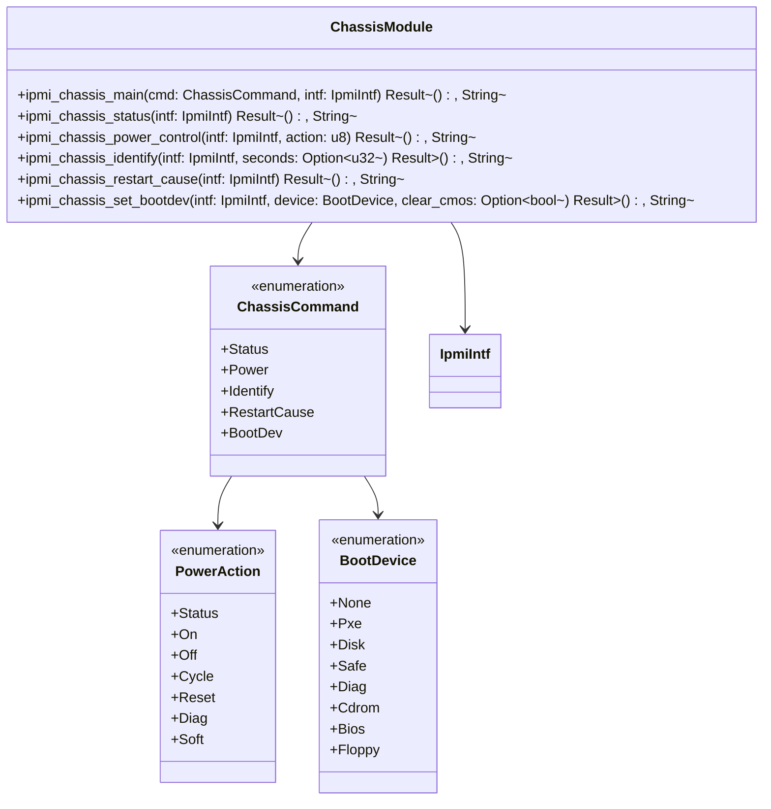
```mermaid
classDiagram
    class ChassisCommand {
        <<enumeration>>
        +Status
        +Power
        +Identify
        +RestartCause
        +BootDev
    }
    
    class PowerAction {
        <<enumeration>>
        +Status
        +On
        +Off
        +Cycle
        +Reset
        +Diag
        +Soft
    }
    
    class BootDevice {
        <<enumeration>>
        +None
        +Pxe
        +Disk
        +Safe
        +Diag
        +Cdrom
        +Bios
        +Floppy
    }
    
    class ChassisModule {
        +ipmi_chassis_main(cmd: ChassisCommand, intf: IpmiIntf) Result~(), String~
        +ipmi_chassis_status(intf: IpmiIntf) Result~(), String~
        +ipmi_chassis_power_control(intf: IpmiIntf, action: u8) Result~(), String~
        +ipmi_chassis_identify(intf: IpmiIntf, seconds: Option~u32~) Result~(), String~
        +ipmi_chassis_restart_cause(intf: IpmiIntf) Result~(), String~
        +ipmi_chassis_set_bootdev(intf: IpmiIntf, device: BootDevice, clear_cmos: Option~bool~) Result~(), String~
    }
    
    ChassisCommand --> PowerAction
    ChassisCommand --> BootDevice
    ChassisModule --> ChassisCommand
    ChassisModule --> IpmiIntf
```

**包图**:

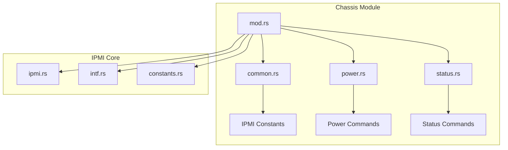
```mermaid
graph TB
    subgraph "Chassis Module"
        A[mod.rs] --> B[common.rs]
        A --> C[power.rs]
        A --> D[status.rs]
        
        B --> E[IPMI Constants]
        C --> F[Power Commands]
        D --> G[Status Commands]
    end
    
    subgraph "IPMI Core"
        H[ipmi.rs]
        I[intf.rs]
        J[constants.rs]
    end
    
    A --> H
    A --> I
    A --> J
```

**流程图**:

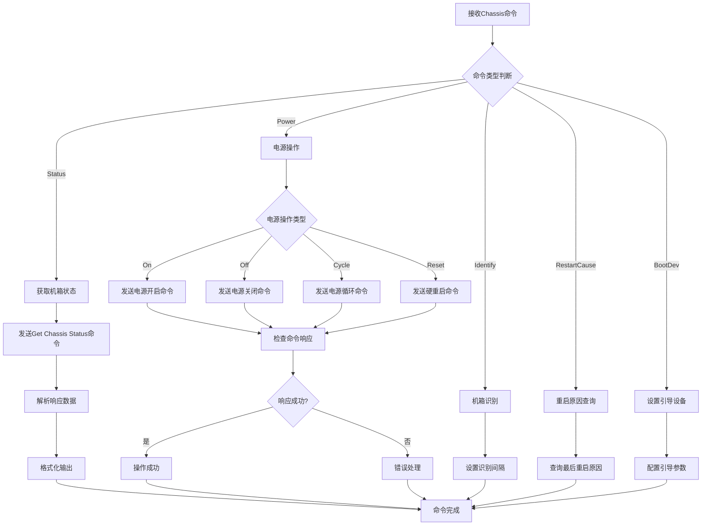
```mermaid
flowchart TD
    A[接收Chassis命令] --> B{命令类型判断}
    
    B -->|Status| C[获取机箱状态]
    B -->|Power| D[电源操作]
    B -->|Identify| E[机箱识别]
    B -->|RestartCause| F[重启原因查询]
    B -->|BootDev| G[设置引导设备]
    
    C --> H[发送Get Chassis Status命令]
    H --> I[解析响应数据]
    I --> J[格式化输出]
    
    D --> K{电源操作类型}
    K -->|On| L[发送电源开启命令]
    K -->|Off| M[发送电源关闭命令]
    K -->|Cycle| N[发送电源循环命令]
    K -->|Reset| O[发送硬重启命令]
    
    L --> P[检查命令响应]
    M --> P
    N --> P
    O --> P
    
    P --> Q{响应成功?}
    Q -->|是| R[操作成功]
    Q -->|否| S[错误处理]
    
    E --> T[设置识别间隔]
    F --> U[查询最后重启原因]
    G --> V[配置引导参数]
    
    J --> W[命令完成]
    R --> W
    S --> W
    T --> W
    U --> W
    V --> W
```

**时序图**:

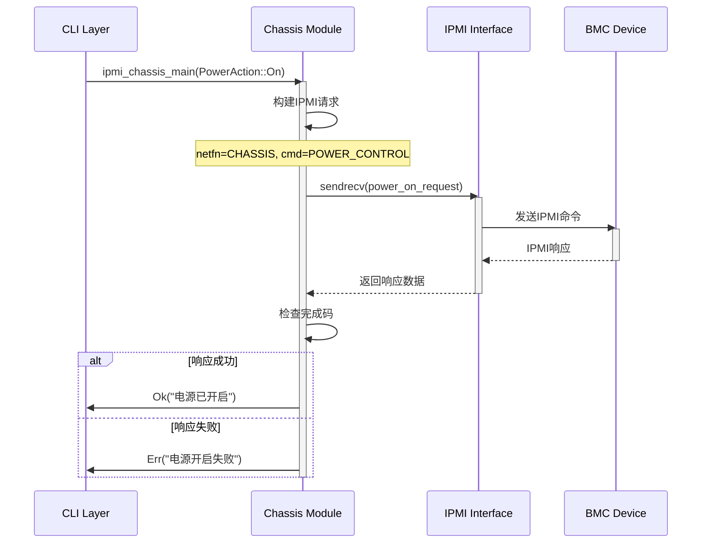
```mermaid
sequenceDiagram
    participant CLI as CLI Layer
    participant Chassis as Chassis Module
    participant IPMI as IPMI Interface
    participant BMC as BMC Device
    
    CLI->>Chassis: ipmi_chassis_main(PowerAction::On)
    activate Chassis
    
    Chassis->>Chassis: 构建IPMI请求
    Note over Chassis: netfn=CHASSIS, cmd=POWER_CONTROL
    
    Chassis->>IPMI: sendrecv(power_on_request)
    activate IPMI
    
    IPMI->>BMC: 发送IPMI命令
    activate BMC
    
    BMC-->>IPMI: IPMI响应
    deactivate BMC
    
    IPMI-->>Chassis: 返回响应数据
    deactivate IPMI
    
    Chassis->>Chassis: 检查完成码
    
    alt 响应成功
        Chassis->>CLI: Ok("电源已开启")
    else 响应失败
        Chassis->>CLI: Err("电源开启失败")
    end
    
    deactivate Chassis
```

#### 2.3.2 MC (Management Controller) 模块设计

**模块功能**:
MC 模块负责管理控制器相关功能，包括设备信息查询、控制器重置等。

**主要接口**:
- `ipmi_mc_main()`: 主入口函数
- `ipmi_mc_get_device_id()`: 获取设备ID信息
- `ipmi_mc_reset()`: 重置管理控制器

**数据结构**:

```rust
// MC命令枚举
pub enum McCommand {
    Info,
    Reset { reset_type: String },
}

// 设备ID响应结构体
#[repr(C)]
pub struct IpmDevidRsp {
    pub device_id: u8,
    pub device_revision: u8,
    pub fw_rev1: u8,
    pub fw_rev2: u8,
    pub ipmi_version: u8,
    pub adtl_device_support: u8,
    pub manufacturer_id: [u8; 3],
    pub product_id: [u8; 2],
    pub aux_fw_rev: [u8; 4],
}
```

**UML类图**:

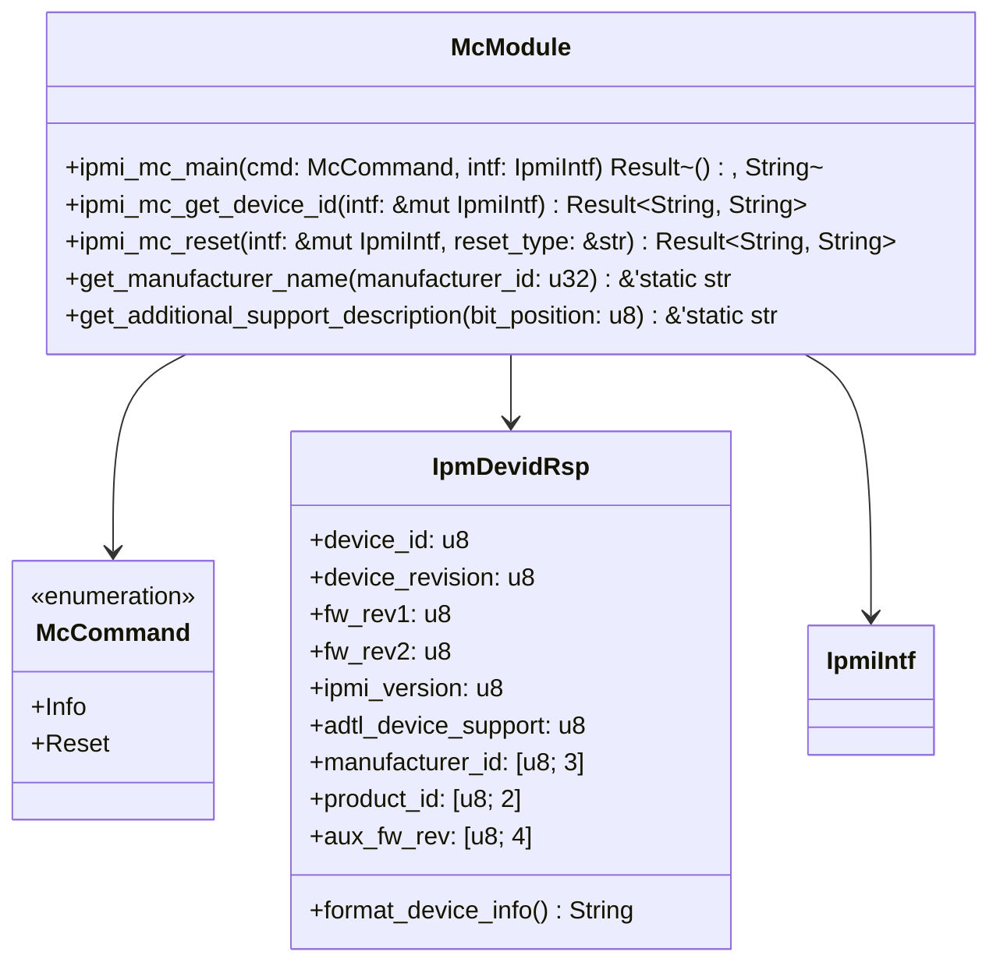
```mermaid
classDiagram
    class McCommand {
        <<enumeration>>
        +Info
        +Reset
    }
    
    class IpmDevidRsp {
        +device_id: u8
        +device_revision: u8
        +fw_rev1: u8
        +fw_rev2: u8
        +ipmi_version: u8
        +adtl_device_support: u8
        +manufacturer_id: [u8; 3]
        +product_id: [u8; 2]
        +aux_fw_rev: [u8; 4]
        +format_device_info() String
    }
    
    class McModule {
        +ipmi_mc_main(cmd: McCommand, intf: IpmiIntf) Result~(), String~
        +ipmi_mc_get_device_id(intf: &mut IpmiIntf) Result~String, String~
        +ipmi_mc_reset(intf: &mut IpmiIntf, reset_type: &str) Result~String, String~
        +get_manufacturer_name(manufacturer_id: u32) &'static str
        +get_additional_support_description(bit_position: u8) &'static str
    }
    
    McModule --> McCommand
    McModule --> IpmDevidRsp
    McModule --> IpmiIntf
```

**包图**:

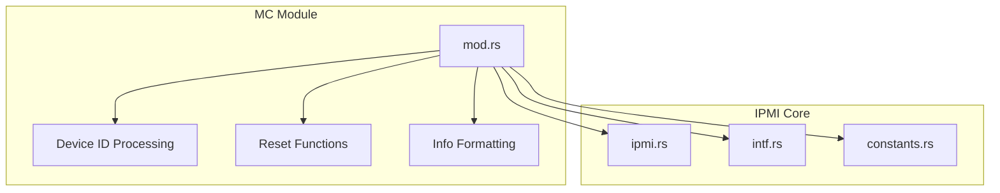
```mermaid
graph TB
    subgraph "MC Module"
        A[mod.rs] --> B[Device ID Processing]
        A --> C[Reset Functions]
        A --> D[Info Formatting]
    end
    
    subgraph "IPMI Core"
        E[ipmi.rs]
        F[intf.rs]
        G[constants.rs]
    end
    
    A --> E
    A --> F
    A --> G
```

**流程图**:

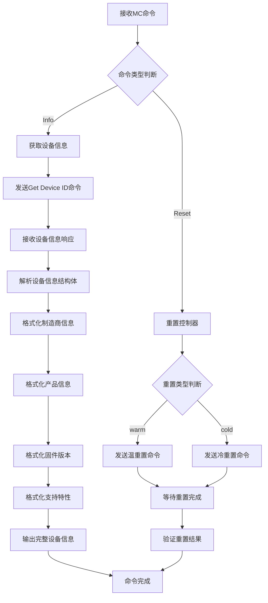
```mermaid
flowchart TD
    A[接收MC命令] --> B{命令类型判断}
    
    B -->|Info| C[获取设备信息]
    B -->|Reset| D[重置控制器]
    
    C --> E[发送Get Device ID命令]
    E --> F[接收设备信息响应]
    F --> G[解析设备信息结构体]
    G --> H[格式化制造商信息]
    H --> I[格式化产品信息]
    I --> J[格式化固件版本]
    J --> K[格式化支持特性]
    K --> L[输出完整设备信息]
    
    D --> M{重置类型判断}
    M -->|warm| N[发送温重置命令]
    M -->|cold| O[发送冷重置命令]
    
    N --> P[等待重置完成]
    O --> P
    P --> Q[验证重置结果]
    
    L --> R[命令完成]
    Q --> R
```

**时序图**:

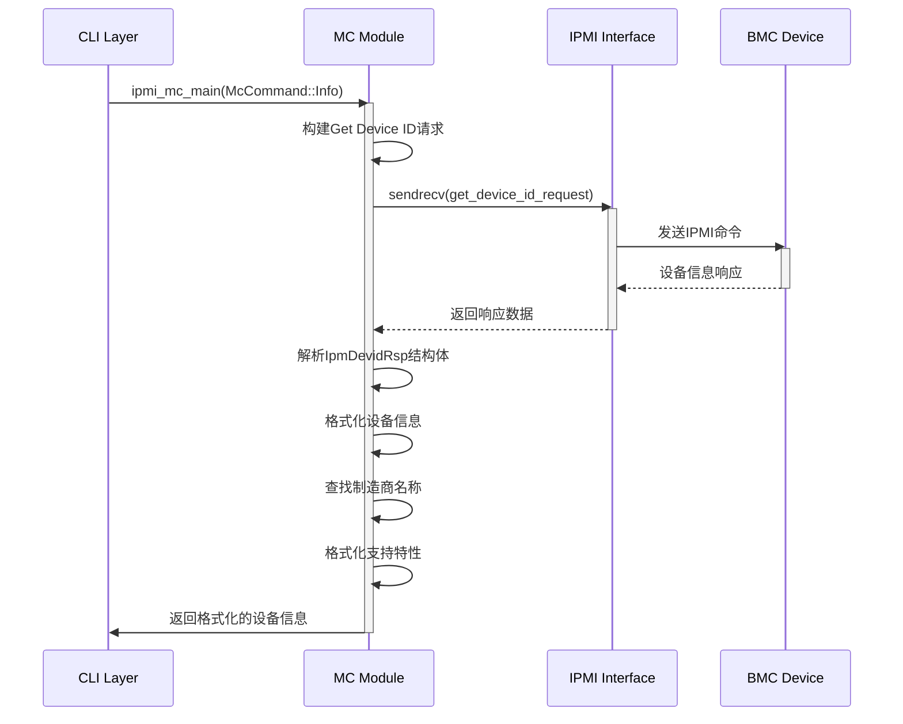
```mermaid
sequenceDiagram
    participant CLI as CLI Layer
    participant MC as MC Module
    participant IPMI as IPMI Interface
    participant BMC as BMC Device
    
    CLI->>MC: ipmi_mc_main(McCommand::Info)
    activate MC
    
    MC->>MC: 构建Get Device ID请求
    
    MC->>IPMI: sendrecv(get_device_id_request)
    activate IPMI
    
    IPMI->>BMC: 发送IPMI命令
    activate BMC
    
    BMC-->>IPMI: 设备信息响应
    deactivate BMC
    
    IPMI-->>MC: 返回响应数据
    deactivate IPMI
    
    MC->>MC: 解析IpmDevidRsp结构体
    MC->>MC: 格式化设备信息
    MC->>MC: 查找制造商名称
    MC->>MC: 格式化支持特性
    
    MC->>CLI: 返回格式化的设备信息
    deactivate MC
```

#### 2.3.3 Sensor 模块设计

**模块功能**:
Sensor 模块负责传感器管理功能，包括传感器列表查询、阈值管理等。

**主要接口**:
- `ipmi_sensor_main()`: 主入口函数
- `ipmi_sensor_list()`: 列出所有传感器

**数据结构**:

```rust
// 传感器命令枚举
pub enum SensorCommand {
    List,
}

// 阈值类型枚举
pub enum ThresholdType {
    UNR, UCR, UNC, LNC, LCR, LNR,
}

// 阈值参数结构体
pub struct ThreshArgs {
    pub id: String,
    pub subcmd: ThreshSubcommand,
}
```

**UML类图**:

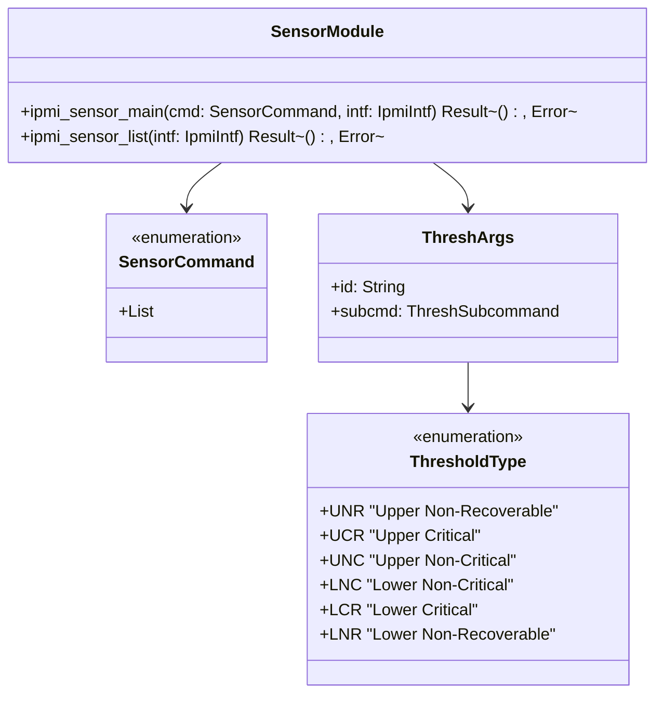
```mermaid
classDiagram
    class SensorCommand {
        <<enumeration>>
        +List
    }
    
    class ThresholdType {
        <<enumeration>>
        +UNR "Upper Non-Recoverable"
        +UCR "Upper Critical"
        +UNC "Upper Non-Critical"
        +LNC "Lower Non-Critical"
        +LCR "Lower Critical"
        +LNR "Lower Non-Recoverable"
    }
    
    class ThreshArgs {
        +id: String
        +subcmd: ThreshSubcommand
    }
    
    class SensorModule {
        +ipmi_sensor_main(cmd: SensorCommand, intf: IpmiIntf) Result~(), Error~
        +ipmi_sensor_list(intf: IpmiIntf) Result~(), Error~
    }
    
    SensorModule --> SensorCommand
    SensorModule --> ThreshArgs
    ThreshArgs --> ThresholdType
```

**包图**:

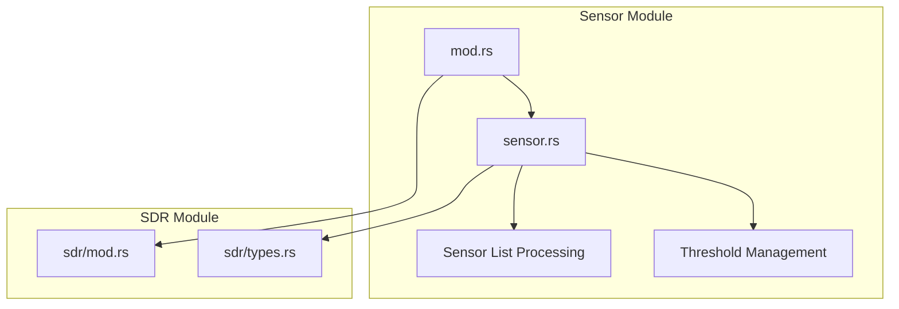
```mermaid
graph TB
    subgraph "Sensor Module"
        A[mod.rs] --> B[sensor.rs]
        B --> C[Sensor List Processing]
        B --> D[Threshold Management]
    end
    
    subgraph "SDR Module"
        E[sdr/mod.rs]
        F[sdr/types.rs]
    end
    
    A --> E
    B --> F
```

**流程图**:

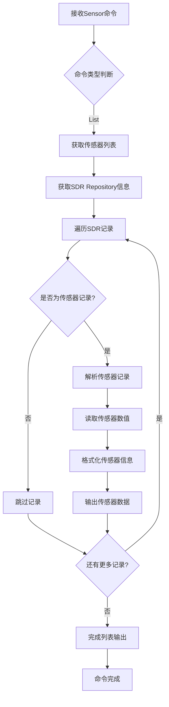
```mermaid
flowchart TD
    A[接收Sensor命令] --> B{命令类型判断}
    
    B -->|List| C[获取传感器列表]
    
    C --> D[获取SDR Repository信息]
    D --> E[遍历SDR记录]
    E --> F{是否为传感器记录?}
    
    F -->|是| G[解析传感器记录]
    F -->|否| H[跳过记录]
    
    G --> I[读取传感器数值]
    I --> J[格式化传感器信息]
    J --> K[输出传感器数据]
    
    H --> L{还有更多记录?}
    K --> L
    
    L -->|是| E
    L -->|否| M[完成列表输出]
    
    M --> N[命令完成]
```

**时序图**:

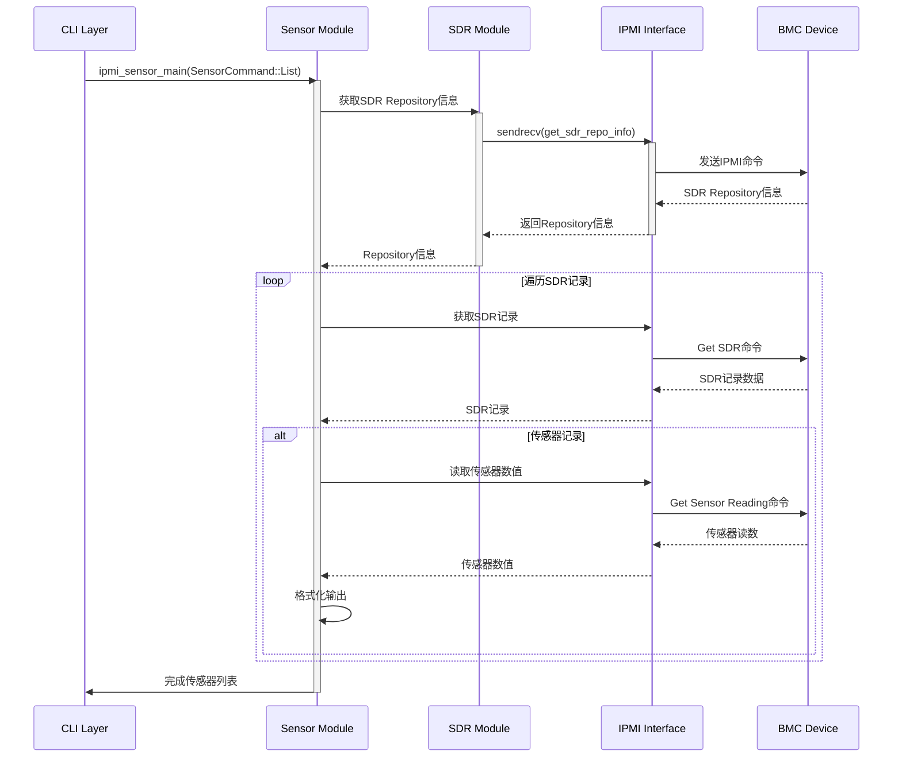
```mermaid
sequenceDiagram
    participant CLI as CLI Layer
    participant Sensor as Sensor Module
    participant SDR as SDR Module 
    participant IPMI as IPMI Interface
    participant BMC as BMC Device
    
    CLI->>Sensor: ipmi_sensor_main(SensorCommand::List)
    activate Sensor
    
    Sensor->>SDR: 获取SDR Repository信息
    activate SDR
    
    SDR->>IPMI: sendrecv(get_sdr_repo_info)
    activate IPMI
    
    IPMI->>BMC: 发送IPMI命令
    BMC-->>IPMI: SDR Repository信息
    
    IPMI-->>SDR: 返回Repository信息
    deactivate IPMI
    
    SDR-->>Sensor: Repository信息
    deactivate SDR
    
    loop 遍历SDR记录
        Sensor->>IPMI: 获取SDR记录
        IPMI->>BMC: Get SDR命令
        BMC-->>IPMI: SDR记录数据
        IPMI-->>Sensor: SDR记录
        
        alt 传感器记录
            Sensor->>IPMI: 读取传感器数值
            IPMI->>BMC: Get Sensor Reading命令
            BMC-->>IPMI: 传感器读数
            IPMI-->>Sensor: 传感器数值
            Sensor->>Sensor: 格式化输出
        end
    end
    
    Sensor->>CLI: 完成传感器列表
    deactivate Sensor
```

#### 2.3.4 SDR 模块设计

**模块功能**:
SDR 模块负责传感器数据记录管理，包括SDR仓库信息查询、记录列表等。

**主要接口**:
- `ipmi_sdr_main()`: 主入口函数
- `ipmi_sdr_info()`: 显示SDR仓库信息
- `ipmi_sdr_list()`: 列出SDR记录

**数据结构**:

```rust
// SDR命令枚举
pub enum SdrCommand {
    Info,
    List { record_type: Option<SdrRecordType> },
    Elist { record_type: Option<SdrRecordType> },
}

// SDR记录类型枚举
pub enum SdrRecordType {
    All, Full, Compact, Event, Mcloc, Fru, Generic,
}

// SDR仓库信息结构体
pub struct SdrRepositoryInfo {
    pub version: u8,
    pub record_count: u16,
    pub free_space: u16,
    pub most_recent_addition: u32,
    pub most_recent_erase: u32,
    pub support: u8,
}
```

**UML类图**:

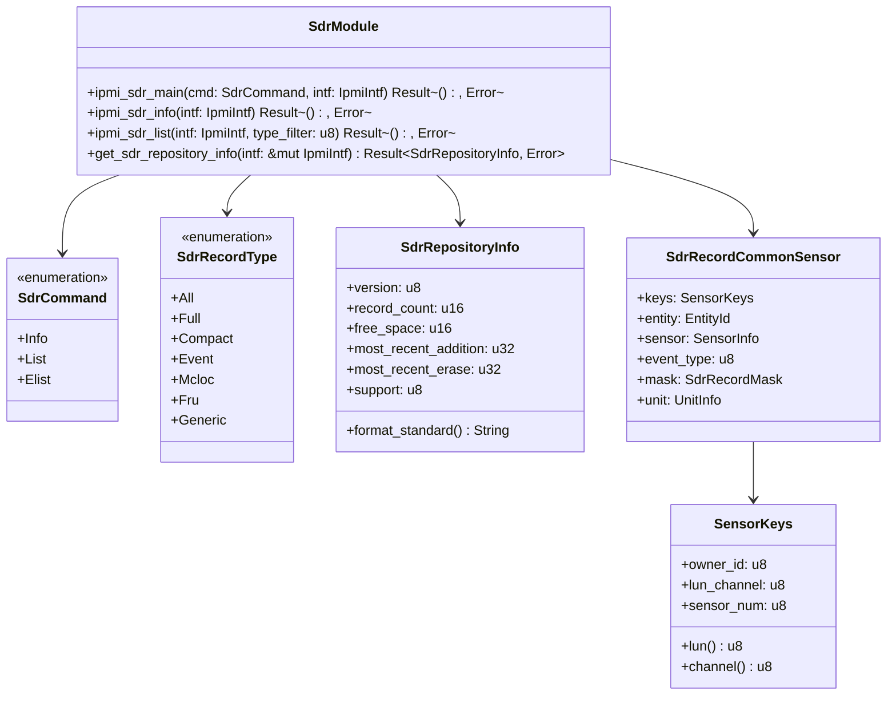
```mermaid
classDiagram
    class SdrCommand {
        <<enumeration>>
        +Info
        +List
        +Elist
    }
    
    class SdrRecordType {
        <<enumeration>>
        +All
        +Full
        +Compact
        +Event
        +Mcloc
        +Fru
        +Generic
    }
    
    class SdrRepositoryInfo {
        +version: u8
        +record_count: u16
        +free_space: u16
        +most_recent_addition: u32
        +most_recent_erase: u32
        +support: u8
        +format_standard() String
    }
    
    class SdrRecordCommonSensor {
        +keys: SensorKeys
        +entity: EntityId
        +sensor: SensorInfo
        +event_type: u8
        +mask: SdrRecordMask
        +unit: UnitInfo
    }
    
    class SensorKeys {
        +owner_id: u8
        +lun_channel: u8
        +sensor_num: u8
        +lun() u8
        +channel() u8
    }
    
    class SdrModule {
        +ipmi_sdr_main(cmd: SdrCommand, intf: IpmiIntf) Result~(), Error~
        +ipmi_sdr_info(intf: IpmiIntf) Result~(), Error~
        +ipmi_sdr_list(intf: IpmiIntf, type_filter: u8) Result~(), Error~
        +get_sdr_repository_info(intf: &mut IpmiIntf) Result~SdrRepositoryInfo, Error~
    }
    
    SdrModule --> SdrCommand
    SdrModule --> SdrRecordType
    SdrModule --> SdrRepositoryInfo
    SdrModule --> SdrRecordCommonSensor
    SdrRecordCommonSensor --> SensorKeys
```

**包图**:

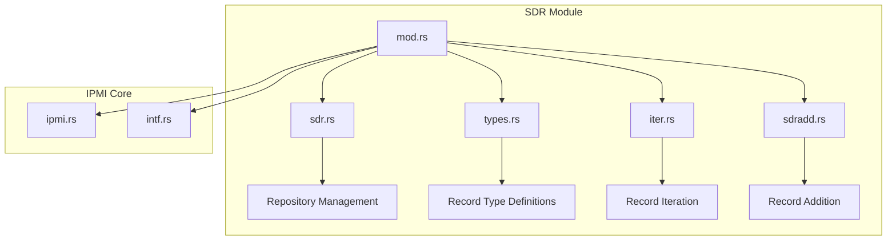
```mermaid
graph TB
    subgraph "SDR Module"
        A[mod.rs] --> B[sdr.rs]
        A --> C[types.rs]
        A --> D[iter.rs]
        A --> E[sdradd.rs]
        
        B --> F[Repository Management]
        C --> G[Record Type Definitions] 
        D --> H[Record Iteration]
        E --> I[Record Addition]
    end
    
    subgraph "IPMI Core"
        J[ipmi.rs]
        K[intf.rs]
    end
    
    A --> J
    A --> K
```

**流程图**:

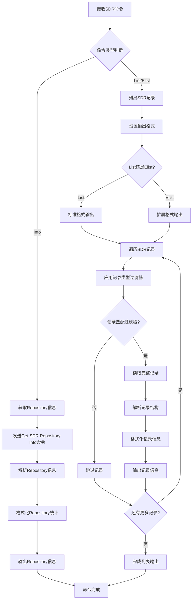
```mermaid
flowchart TD
    A[接收SDR命令] --> B{命令类型判断}
    
    B -->|Info| C[获取Repository信息]
    B -->|List/Elist| D[列出SDR记录]
    
    C --> E[发送Get SDR Repository Info命令]
    E --> F[解析Repository信息]
    F --> G[格式化Repository统计]
    G --> H[输出Repository信息]
    
    D --> I[设置输出格式]
    I --> J{List还是Elist?}
    J -->|List| K[标准格式输出]
    J -->|Elist| L[扩展格式输出]
    
    K --> M[遍历SDR记录]
    L --> M
    
    M --> N[应用记录类型过滤器]
    N --> O{记录匹配过滤器?}
    
    O -->|是| P[读取完整记录]
    O -->|否| Q[跳过记录]
    
    P --> R[解析记录结构]
    R --> S[格式化记录信息]
    S --> T[输出记录信息]
    
    Q --> U{还有更多记录?}
    T --> U
    
    U -->|是| M
    U -->|否| V[完成列表输出]
    
    H --> W[命令完成]
    V --> W
```

**时序图**:

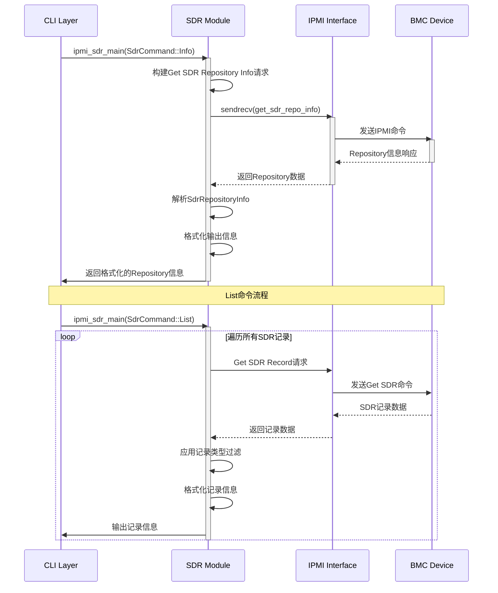
```mermaid
sequenceDiagram
    participant CLI as CLI Layer
    participant SDR as SDR Module
    participant IPMI as IPMI Interface
    participant BMC as BMC Device
    
    CLI->>SDR: ipmi_sdr_main(SdrCommand::Info)
    activate SDR
    
    SDR->>SDR: 构建Get SDR Repository Info请求
    
    SDR->>IPMI: sendrecv(get_sdr_repo_info)
    activate IPMI
    
    IPMI->>BMC: 发送IPMI命令
    activate BMC
    
    BMC-->>IPMI: Repository信息响应
    deactivate BMC
    
    IPMI-->>SDR: 返回Repository数据
    deactivate IPMI
    
    SDR->>SDR: 解析SdrRepositoryInfo
    SDR->>SDR: 格式化输出信息
    
    SDR->>CLI: 返回格式化的Repository信息
    deactivate SDR
    
    Note over CLI,BMC: List命令流程
    
    CLI->>SDR: ipmi_sdr_main(SdrCommand::List)
    activate SDR
    
    loop 遍历所有SDR记录
        SDR->>IPMI: Get SDR Record请求
        IPMI->>BMC: 发送Get SDR命令
        BMC-->>IPMI: SDR记录数据
        IPMI-->>SDR: 返回记录数据
        
        SDR->>SDR: 应用记录类型过滤
        SDR->>SDR: 格式化记录信息
        SDR->>CLI: 输出记录信息
    end
    
    deactivate SDR
```

#### 2.3.5 SEL (System Event Log) 模块设计

**模块功能**:
SEL 模块负责系统事件日志管理，包括事件日志查询、清除、添加等功能。

**主要接口**:
- `ipmi_sel_main()`: 主入口函数
- `ipmi_sel_info()`: 显示SEL信息
- `ipmi_sel_list()`: 列出事件日志
- `ipmi_sel_clear()`: 清除事件日志

**数据结构**:

```rust
// SEL命令枚举
pub enum SelCommand {
    Info,
    List,
    Elist,
    Clear,
    Get { record_id: u16 },
    Add { record_data: Vec<u8> },
    Save { filename: String },
}

// SEL信息结构体
pub struct SelInfo {
    pub version: u8,
    pub entries: u16,
    pub free_space: u16,
    pub most_recent_addition: u32,
    pub most_recent_erase: u32,
    pub support: u8,
}

// SEL事件记录结构体
pub struct SelEventRecord {
    pub record_id: u16,
    pub record_type: u8,
    pub timestamp: u32,
    pub generator_id: u16,
    pub event_msg_format_version: u8,
    pub sensor_type: u8,
    pub sensor_number: u8,
    pub event_type: u8,
    pub event_data: [u8; 3],
}
```

**UML类图**:

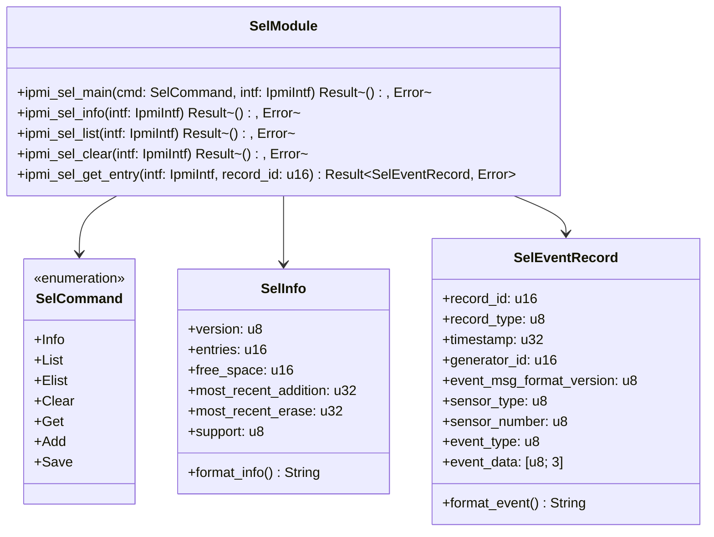
```mermaid
classDiagram
    class SelCommand {
        <<enumeration>>
        +Info
        +List
        +Elist
        +Clear
        +Get
        +Add
        +Save
    }
    
    class SelInfo {
        +version: u8
        +entries: u16
        +free_space: u16
        +most_recent_addition: u32
        +most_recent_erase: u32
        +support: u8
        +format_info() String
    }
    
    class SelEventRecord {
        +record_id: u16
        +record_type: u8
        +timestamp: u32
        +generator_id: u16
        +event_msg_format_version: u8
        +sensor_type: u8
        +sensor_number: u8
        +event_type: u8
        +event_data: [u8; 3]
        +format_event() String
    }
    
    class SelModule {
        +ipmi_sel_main(cmd: SelCommand, intf: IpmiIntf) Result~(), Error~
        +ipmi_sel_info(intf: IpmiIntf) Result~(), Error~
        +ipmi_sel_list(intf: IpmiIntf) Result~(), Error~
        +ipmi_sel_clear(intf: IpmiIntf) Result~(), Error~
        +ipmi_sel_get_entry(intf: IpmiIntf, record_id: u16) Result~SelEventRecord, Error~
    }
    
    SelModule --> SelCommand
    SelModule --> SelInfo
    SelModule --> SelEventRecord
```

**包图**:

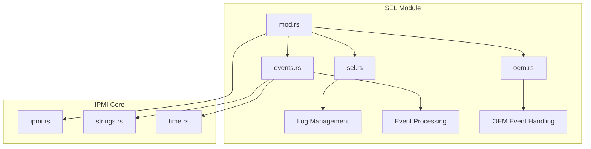
```mermaid
graph TB
    subgraph "SEL Module"
        A[mod.rs] --> B[sel.rs]
        A --> C[events.rs]
        A --> D[oem.rs]
        
        B --> E[Log Management]
        C --> F[Event Processing]
        D --> G[OEM Event Handling]
    end
    
    subgraph "IPMI Core"
        H[ipmi.rs]
        I[strings.rs]
        J[time.rs]
    end
    
    A --> H
    C --> I
    C --> J
```

**流程图**:

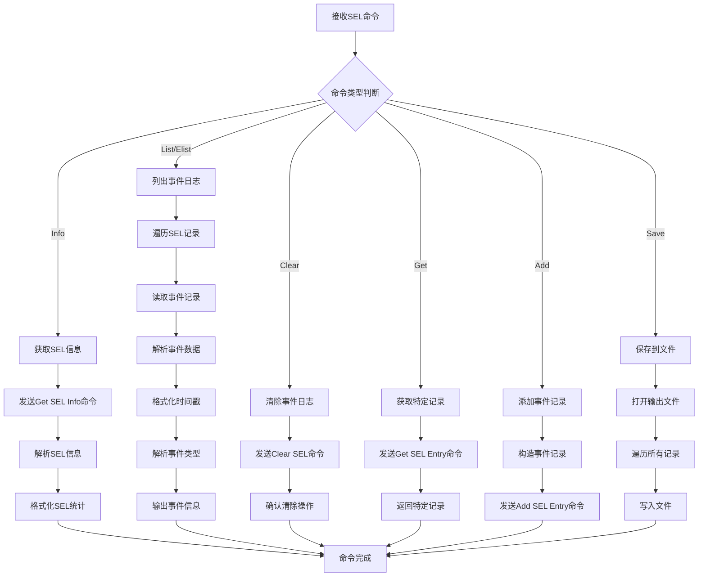
```mermaid
flowchart TD
    A[接收SEL命令] --> B{命令类型判断}
    
    B -->|Info| C[获取SEL信息]
    B -->|List/Elist| D[列出事件日志]
    B -->|Clear| E[清除事件日志]
    B -->|Get| F[获取特定记录]
    B -->|Add| G[添加事件记录]
    B -->|Save| H[保存到文件]
    
    C --> I[发送Get SEL Info命令]
    I --> J[解析SEL信息]
    J --> K[格式化SEL统计]
    
    D --> L[遍历SEL记录]
    L --> M[读取事件记录]
    M --> N[解析事件数据]
    N --> O[格式化时间戳]
    O --> P[解析事件类型]
    P --> Q[输出事件信息]
    
    E --> R[发送Clear SEL命令]
    R --> S[确认清除操作]
    
    F --> T[发送Get SEL Entry命令]
    T --> U[返回特定记录]
    
    G --> V[构造事件记录]
    V --> W[发送Add SEL Entry命令]
    
    H --> X[打开输出文件]
    X --> Y[遍历所有记录]
    Y --> Z[写入文件]
    
    K --> AA[命令完成]
    Q --> AA
    S --> AA
    U --> AA
    W --> AA
    Z --> AA
```

**时序图**:

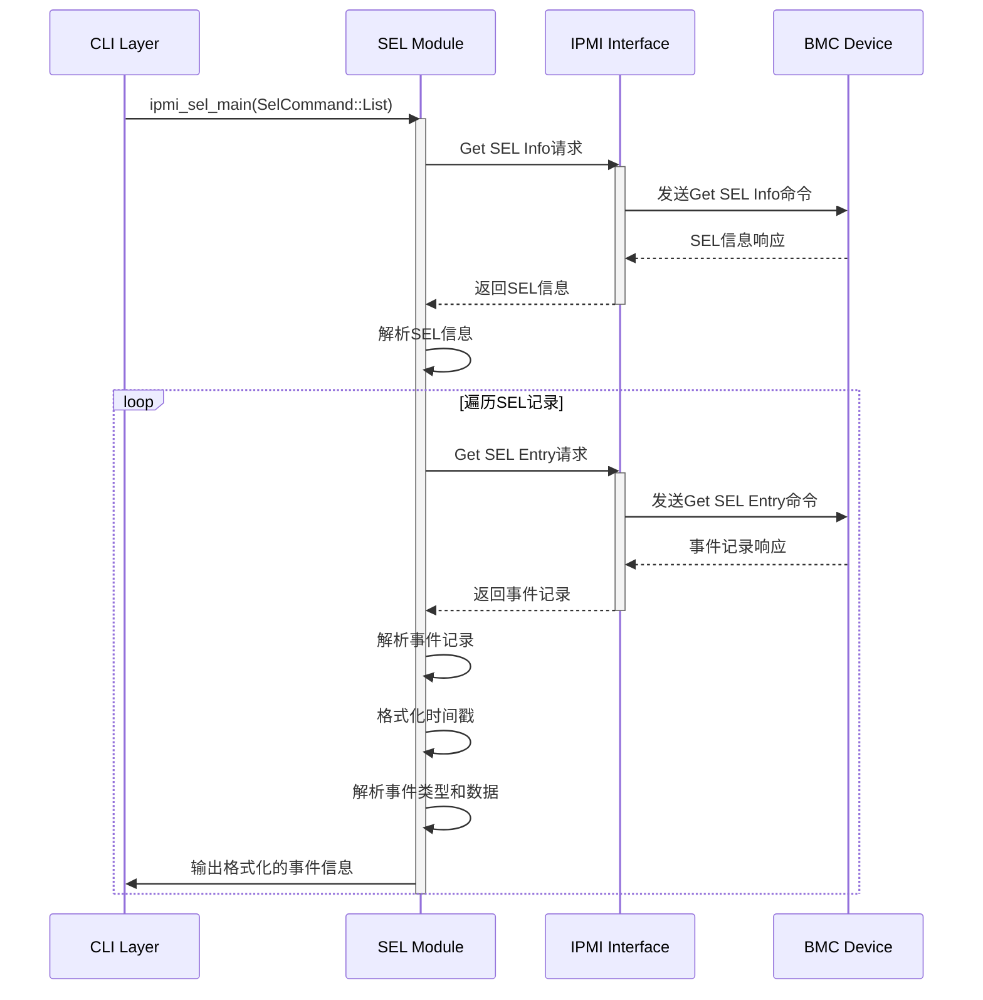
```mermaid
sequenceDiagram
    participant CLI as CLI Layer
    participant SEL as SEL Module
    participant IPMI as IPMI Interface
    participant BMC as BMC Device
    
    CLI->>SEL: ipmi_sel_main(SelCommand::List)
    activate SEL
    
    SEL->>IPMI: Get SEL Info请求
    activate IPMI
    IPMI->>BMC: 发送Get SEL Info命令
    BMC-->>IPMI: SEL信息响应
    IPMI-->>SEL: 返回SEL信息
    deactivate IPMI
    
    SEL->>SEL: 解析SEL信息
    
    loop 遍历SEL记录
        SEL->>IPMI: Get SEL Entry请求
        activate IPMI
        IPMI->>BMC: 发送Get SEL Entry命令
        BMC-->>IPMI: 事件记录响应
        IPMI-->>SEL: 返回事件记录
        deactivate IPMI
        
        SEL->>SEL: 解析事件记录
        SEL->>SEL: 格式化时间戳
        SEL->>SEL: 解析事件类型和数据
        SEL->>CLI: 输出格式化的事件信息
    end
    
    deactivate SEL
```

#### 2.3.6 User 模块设计

**模块功能**:
User 模块负责用户管理功能，包括用户列表查询、用户创建、权限管理等。

**主要接口**:
- `ipmi_user_main()`: 主入口函数
- `ipmi_user_list()`: 列出用户信息
- `ipmi_user_set()`: 设置用户信息
- `ipmi_user_disable()/enable()`: 禁用/启用用户

**数据结构**:

```rust
// 用户命令枚举
pub enum UserCommand {
    Summary,
    List { channel: Option<u8> },
    Set { 
        user_id: u8, 
        name: Option<String>,
        password: Option<String>,
        privilege: Option<PrivilegeLevel>,
    },
    Disable { user_id: u8 },
    Enable { user_id: u8 },
    Priv { user_id: u8, privilege: PrivilegeLevel, channel: Option<u8> },
    Test { user_id: u8, password: String },
}

// 权限级别枚举
pub enum PrivilegeLevel {
    Callback,
    User,
    Operator,
    Administrator,
    OEM,
}

// 用户信息结构体
pub struct UserInfo {
    pub id: u8,
    pub name: String,
    pub fixed_name: bool,
    pub access_available: bool,
    pub link_auth: bool,  
    pub ipmi_msg: bool,
    pub privilege_limit: PrivilegeLevel,
    pub enable_status: bool,
}
```

**UML类图**:

```mermaid
classDiagram
    class UserCommand {
        <<enumeration>>
        +Summary
        +List
        +Set
        +Disable
        +Enable
        +Priv
        +Test
    }
    
    class PrivilegeLevel {
        <<enumeration>>
        +Callback
        +User
        +Operator
        +Administrator
        +OEM
    }
    
    class UserInfo {
        +id: u8
        +name: String
        +fixed_name: bool
        +access_available: bool
        +link_auth: bool
        +ipmi_msg: bool
        +privilege_limit: PrivilegeLevel
        +enable_status: bool
        +format_info() String
    }
    
    class UserModule {
        +ipmi_user_main(cmd: UserCommand, intf: IpmiIntf) Result~(), Error~
        +ipmi_user_list(intf: IpmiIntf, channel: Option~u8~) Result~(), Error~
        +ipmi_user_set(intf: IpmiIntf, user_id: u8, params: UserParams) Result~(), Error~
        +ipmi_user_disable(intf: IpmiIntf, user_id: u8) Result~(), Error~
        +ipmi_user_enable(intf: IpmiIntf, user_id: u8) Result~(), Error~
        +ipmi_user_test(intf: IpmiIntf, user_id: u8, password: String) Result~(), Error~
    }
    
    UserModule --> UserCommand
    UserModule --> PrivilegeLevel
    UserModule --> UserInfo
    UserInfo --> PrivilegeLevel
```

**包图**:

```mermaid
graph TB
    subgraph "User Module"
        A[mod.rs] --> B[user.rs]
        A --> C[auth.rs]
        A --> D[privilege.rs]
        
        B --> E[User Management]
        C --> F[Authentication]
        D --> G[Privilege Control]
    end
    
    subgraph "IPMI Core"
        H[ipmi.rs]
        I[constants.rs]
    end
    
    A --> H
    A --> I
```

**流程图**:

```mermaid
flowchart TD
    A[接收User命令] --> B{命令类型判断}
    
    B -->|Summary| C[显示用户摘要]
    B -->|List| D[列出用户信息]
    B -->|Set| E[设置用户信息]
    B -->|Disable| F[禁用用户]
    B -->|Enable| G[启用用户]
    B -->|Priv| H[设置用户权限]
    B -->|Test| I[测试用户密码]
    
    C --> J[获取用户数量信息]
    J --> K[获取最大用户数]
    K --> L[获取启用用户数]
    L --> M[获取固定用户数]
    M --> N[输出用户摘要统计]
    
    D --> O[遍历用户ID]
    O --> P[获取用户名称]
    P --> Q[获取用户访问信息]
    Q --> R[获取用户权限信息]
    R --> S[格式化用户信息]
    S --> T[输出用户列表]
    
    E --> U{设置类型判断}
    U -->|名称| V[设置用户名称]
    U -->|密码| W[设置用户密码]
    U -->|权限| X[设置用户权限]
    
    F --> Y[发送禁用用户命令]
    G --> Z[发送启用用户命令]
    H --> AA[发送设置权限命令]
    I --> BB[发送测试密码命令]
    
    N --> CC[命令完成]
    T --> CC
    V --> CC
    W --> CC
    X --> CC
    Y --> CC
    Z --> CC
    AA --> CC
    BB --> CC
```

**时序图**:

```mermaid
sequenceDiagram
    participant CLI as CLI Layer
    participant User as User Module
    participant IPMI as IPMI Interface
    participant BMC as BMC Device
    
    CLI->>User: ipmi_user_main(UserCommand::List)
    activate User
    
    loop 遍历用户ID (1-16)
        User->>IPMI: Get User Name请求
        activate IPMI
        IPMI->>BMC: 发送Get User Name命令
        BMC-->>IPMI: 用户名称响应
        IPMI-->>User: 返回用户名称
        deactivate IPMI
        
        alt 用户存在
            User->>IPMI: Get User Access请求
            activate IPMI
            IPMI->>BMC: 发送Get User Access命令
            BMC-->>IPMI: 用户访问信息响应
            IPMI-->>User: 返回访问信息
            deactivate IPMI
            
            User->>User: 解析用户权限和状态
            User->>CLI: 输出用户信息
        else 用户不存在
            User->>User: 跳过此用户ID
        end
    end
    
    deactivate User
```

#### 2.3.7 LAN 模块设计

**模块功能**:
LAN 模块负责网络配置管理，包括网络参数查询、设置、认证配置等。

**主要接口**:
- `ipmi_lan_main()`: 主入口函数
- `ipmi_lan_print()`: 显示网络配置
- `ipmi_lan_set()`: 设置网络参数
- `ipmi_lan_auth()`: 配置认证参数

**数据结构**:

```rust
// LAN命令枚举
pub enum LanCommand {
    Print { channel: Option<u8> },
    Set { 
        channel: Option<u8>,
        param: String,
        value: String,
    },
    Auth { 
        channel: Option<u8>,
        level: PrivilegeLevel,
        auth_type: AuthType,
    },
    Access { channel: Option<u8> },
    Stats { channel: Option<u8> },
}

// 网络参数枚举
pub enum LanParam {
    IpAddr,
    IpSrc,
    MacAddr,
    SubnetMask,
    DefaultGateway,
    BackupGateway,
    Community,
    DestType,
    DestAddr,
    VlanId,
    VlanPriority,
}

// LAN配置结构体
pub struct LanConfig {
    pub channel: u8,
    pub ip_addr: [u8; 4],
    pub ip_src: u8,
    pub mac_addr: [u8; 6],
    pub subnet_mask: [u8; 4],
    pub default_gateway: [u8; 4],
    pub backup_gateway: [u8; 4],
    pub community: String,
    pub vlan_id: u16,
    pub vlan_priority: u8,
}
```

**UML类图**:

```mermaid
classDiagram
    class LanCommand {
        <<enumeration>>
        +Print
        +Set
        +Auth
        +Access
        +Stats
    }
    
    class LanParam {
        <<enumeration>>
        +IpAddr
        +IpSrc
        +MacAddr
        +SubnetMask
        +DefaultGateway
        +BackupGateway
        +Community
        +DestType
        +DestAddr
        +VlanId
        +VlanPriority
    }
    
    class LanConfig {
        +channel: u8
        +ip_addr: [u8; 4]
        +ip_src: u8
        +mac_addr: [u8; 6]
        +subnet_mask: [u8; 4]
        +default_gateway: [u8; 4]
        +backup_gateway: [u8; 4]
        +community: String
        +vlan_id: u16
        +vlan_priority: u8
        +format_config() String
    }
    
    class LanModule {
        +ipmi_lan_main(cmd: LanCommand, intf: IpmiIntf) Result~(), Error~
        +ipmi_lan_print(intf: IpmiIntf, channel: Option~u8~) Result~(), Error~
        +ipmi_lan_set(intf: IpmiIntf, channel: u8, param: LanParam, value: String) Result~(), Error~
        +ipmi_lan_auth(intf: IpmiIntf, channel: u8, level: PrivilegeLevel, auth_type: AuthType) Result~(), Error~
        +get_lan_param(intf: IpmiIntf, channel: u8, param: u8) Result~Vec~u8~, Error~
        +set_lan_param(intf: IpmiIntf, channel: u8, param: u8, data: &[u8]) Result~(), Error~
    }
    
    LanModule --> LanCommand
    LanModule --> LanParam
    LanModule --> LanConfig
```

**包图**:

```mermaid
graph TB
    subgraph "LAN Module"
        A[mod.rs] --> B[lan.rs]
        A --> C[config.rs]
        A --> D[auth.rs]
        
        B --> E[Parameter Management]
        C --> F[Configuration Processing]
        D --> G[Authentication Setup]
    end
    
    subgraph "IPMI Core"
        H[ipmi.rs]
        I[constants.rs]
    end
    
    A --> H
    A --> I
```

**流程图**:

```mermaid
flowchart TD
    A[接收LAN命令] --> B{命令类型判断}
    
    B -->|Print| C[显示网络配置]
    B -->|Set| D[设置网络参数]
    B -->|Auth| E[配置认证]
    B -->|Access| F[显示访问配置]
    B -->|Stats| G[显示统计信息]
    
    C --> H[获取所有网络参数]
    H --> I[遍历LAN参数]
    I --> J[读取参数值]
    J --> K[格式化参数显示]
    K --> L[输出配置信息]
    
    D --> M{参数类型判断}
    M -->|IP地址| N[设置IP地址]
    M -->|子网掩码| O[设置子网掩码]
    M -->|网关| P[设置默认网关]
    M -->|MAC地址| Q[设置MAC地址]
    M -->|其他| R[设置其他参数]
    
    E --> S[获取当前认证配置]
    S --> T[设置认证类型]
    T --> U[设置权限级别]
    
    F --> V[获取访问配置信息]
    G --> W[获取网络统计信息]
    
    L --> X[命令完成]
    N --> X
    O --> X
    P --> X
    Q --> X
    R --> X
    U --> X
    V --> X
    W --> X
```

**时序图**:

```mermaid
sequenceDiagram
    participant CLI as CLI Layer
    participant LAN as LAN Module
    participant IPMI as IPMI Interface
    participant BMC as BMC Device
    
    CLI->>LAN: ipmi_lan_main(LanCommand::Print)
    activate LAN
    
    Note over LAN: 遍历所有LAN参数
    
    loop 获取LAN参数
        LAN->>IPMI: Get LAN Configuration Parameters
        activate IPMI
        IPMI->>BMC: 发送Get LAN Config命令
        BMC-->>IPMI: LAN参数响应
        IPMI-->>LAN: 返回参数数据
        deactivate IPMI
        
        LAN->>LAN: 解析参数数据
        LAN->>LAN: 格式化参数显示
    end
    
    LAN->>CLI: 输出完整网络配置
    deactivate LAN
    
    Note over CLI,BMC: 设置参数流程
    
    CLI->>LAN: ipmi_lan_main(LanCommand::Set)
    activate LAN
    
    LAN->>LAN: 解析参数名称和值
    LAN->>LAN: 验证参数格式
    
    LAN->>IPMI: Set LAN Configuration Parameters
    activate IPMI
    IPMI->>BMC: 发送Set LAN Config命令
    BMC-->>IPMI: 设置结果响应
    IPMI-->>LAN: 返回设置结果
    deactivate IPMI
    
    alt 设置成功
        LAN->>CLI: 参数设置成功
    else 设置失败
        LAN->>CLI: 参数设置失败及错误信息
    end
    
    deactivate LAN
```

## 3 全局数据结构设计

### 3.1 核心数据结构

#### 3.1.1 IpmiContext 结构体

```rust
pub struct IpmiContext {
    pub base: IpmiBaseContext,
    pub bridging: Option<BridgingContext>,
    pub protocol: ProtocolContext,
    pub output: OutputContext,
}
```

该结构体是系统的核心数据结构，包含：
- 基础上下文信息（地址、通道等）
- 桥接信息（可选）
- 协议相关信息
- 输出格式配置

#### 3.1.2 IpmiBaseContext 结构体

```rust
pub struct IpmiBaseContext {
    pub my_addr: u32,
    pub target_addr: u32,
    pub target_channel: u8,
    pub target_lun: u8,
    pub target_ipmb_addr: u8,
}
```

包含 IPMI 通信的基础地址信息。

#### 3.1.3 命令行参数结构体

```rust
pub struct GlobalArgs {
    pub verbose: u8,
    pub csv_output: bool,
    pub interface: InterfaceType,
    pub hostname: Option<String>,
    pub username: Option<String>,
    pub password: Option<SecretString>,
    // ... 其他参数
}
```

### 3.2 配置文件结构

系统目前主要通过命令行参数进行配置，未来可能支持配置文件。

### 3.3 日志数据结构

系统使用标准的 Rust 日志系统，支持多级别日志输出：
- ERROR: 错误信息
- WARN: 警告信息
- INFO: 一般信息
- DEBUG: 调试信息（需要 -v 参数）

## 4 安全风险分析

### 4.1 主要安全风险

#### 4.1.1 密码泄露风险
- **风险描述**: 命令行参数可能暴露密码
- **缓解措施**: 使用 `SecretString` 类型处理密码，支持密码文件和交互式输入

#### 4.1.2 网络通信安全
- **风险描述**: IPMI 网络通信可能被窃听
- **缓解措施**: 支持加密的 IPMI v2.0 协议，使用安全的认证方式

#### 4.1.3 权限提升风险
- **风险描述**: 不当的权限管理可能导致权限提升
- **缓解措施**: 严格的权限级别控制，默认使用最小权限原则

### 4.2 安全设计原则

- **最小权限**: 默认使用最小必要权限
- **加密传输**: 支持加密的 IPMI 通信
- **安全存储**: 敏感信息使用安全的存储方式
- **输入验证**: 严格验证所有用户输入

## 5 人机交互设计

### 5.1 命令行接口设计

UTIpmiTool 提供命令行接口，遵循 Unix 传统的命令行工具设计原则：

#### 5.1.1 基本命令格式

```bash
utipmitool [全局选项] <子命令> [子命令选项] [参数]
```

#### 5.1.2 全局选项

| 选项 | 长选项        | 描述                |
|------|---------------|---------------------|
| -v   | --verbose     | 增加详细输出级别    |
| -c   | --csv-output  | CSV 格式输出       |
| -H   | --hostname    | 指定目标主机       |
| -U   | --username    | 指定用户名         |
| -P   | --password    | 指定密码           |
| -I   | --interface   | 指定接口类型       |

#### 5.1.3 主要子命令

- `chassis`: 机箱控制（power, status, restart, identify, bootdev, bootparam, poh, policy, selftest, restart_cause）
- `sensor`: 传感器管理（list, get, thresh, reading）
- `sdr`: SDR 管理（list, type, get, dump）
- `sel`: 事件日志（info, list, elist, clear, get, add, save, writeraw, readraw, interpret）
- `mc`: 管理控制器（info, reset, getenables, setenables, guid, watchdog）
- `user`: 用户管理（summary, list, set, disable, enable, priv, test）
- `lan`: 网络配置（print, set, auth, access, stats）

### 5.2 输出格式设计

#### 5.2.1 标准输出格式

默认使用人类可读的表格格式：

```
Sensor ID              : CPU Temp (0x30)
Sensor Type            : Temperature
Sensor Reading         : 45 (+/- 1) degrees C
Status                 : ok
```

#### 5.2.2 CSV 输出格式

使用 `-c` 选项可以输出 CSV 格式，便于程序处理：

```
CPU Temp,Temperature,45,ok
```

### 5.3 错误信息设计

错误信息应该：
- 清晰描述问题
- 提供解决建议
- 包含错误代码（如适用）

示例：
```
Error: Unable to connect to BMC at 192.168.1.100
Possible causes:
  - BMC is not responding
  - Network connectivity issues
  - Invalid credentials
```

## 6 部署方案

### 6.1 系统要求

#### 6.1.1 硬件要求
- x86_64 或 ARM64 架构
- 至少 10MB 磁盘空间
- 支持 IPMI 的硬件平台

#### 6.1.2 软件要求
- Linux 操作系统（内核 4.0+）
- glibc 2.28+
- OpenIPMI 驱动模块（本地接口）

### 6.2 安装方式

#### 6.2.1 RPM 包安装

```bash
# 安装 RPM 包
sudo rpm -ivh utipmitool-0.1.0-1.x86_64.rpm

# 验证安装
utipmitool --version
```

#### 6.2.2 源码编译安装

```bash
# 安装 Rust 工具链
curl --proto '=https' --tlsv1.2 -sSf https://sh.rustup.rs | sh

# 克隆源码
git clone <repository-url>
cd utipmitool

# 编译
cargo build --release

# 安装
sudo cp target/release/utipmitool /usr/local/bin/
```

### 6.3 配置说明

#### 6.3.1 系统配置

确保 OpenIPMI 内核模块已加载：

```bash
# 加载内核模块
sudo modprobe ipmi_devintf
sudo modprobe ipmi_si

# 验证设备文件
ls -l /dev/ipmi*
```

#### 6.3.2 权限配置

普通用户需要适当的权限访问 IPMI 设备：

```bash
# 添加用户到 ipmi 组
sudo usermod -a -G ipmi $USER

# 设置设备权限
sudo chmod 666 /dev/ipmi0
```

### 6.4 验证和测试

#### 6.4.1 基本功能测试

```bash
# 测试本地接口
utipmitool chassis status

# 测试网络接口
utipmitool -I lanplus -H <bmc-ip> -U <username> -P <password> chassis status
```

#### 6.4.2 性能测试

```bash
# 测试响应时间
time utipmitool chassis status

# 测试并发访问
for i in {1..10}; do utipmitool sensor list & done; wait
```

### 6.5 维护和监控

#### 6.5.1 日志配置

系统日志会输出到 syslog，可以通过以下方式查看：

```bash
# 查看系统日志
journalctl -u utipmitool

# 实时监控日志
tail -f /var/log/messages | grep utipmitool
```

#### 6.5.2 性能监控

可以通过以下指标监控系统性能：
- 命令响应时间
- 内存使用量
- CPU 使用率
- 网络连接状态

### 6.6 故障排除

#### 6.6.1 常见问题

1. **设备文件不存在**
   - 检查内核模块是否加载
   - 验证硬件支持 IPMI

2. **权限不足**
   - 检查用户组权限
   - 验证设备文件权限

3. **网络连接失败**
   - 检查网络连通性
   - 验证 BMC 配置
   - 确认认证信息

#### 6.6.2 调试模式

使用详细输出模式进行调试：

```bash
# 一级详细输出
utipmitool -v chassis status

# 最详细输出
utipmitool -vvv chassis status
```

---

## 变更记录

本文档后续变更将在此记录详细信息。 