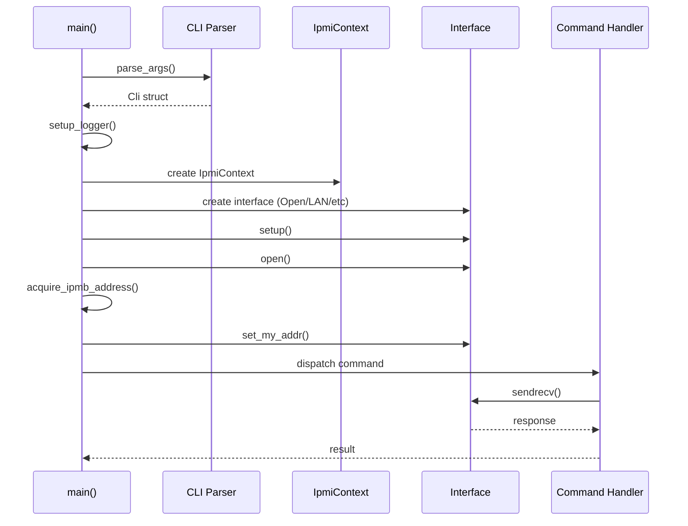
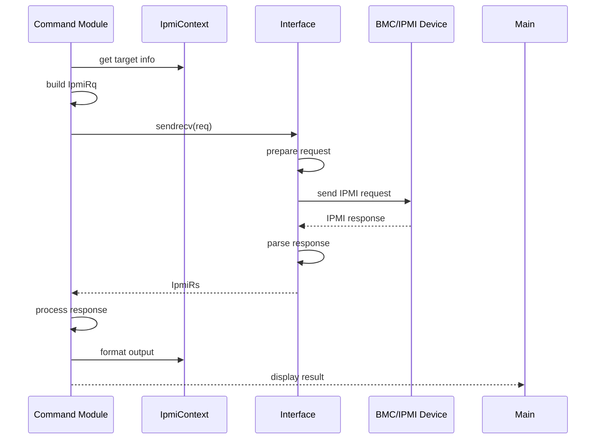
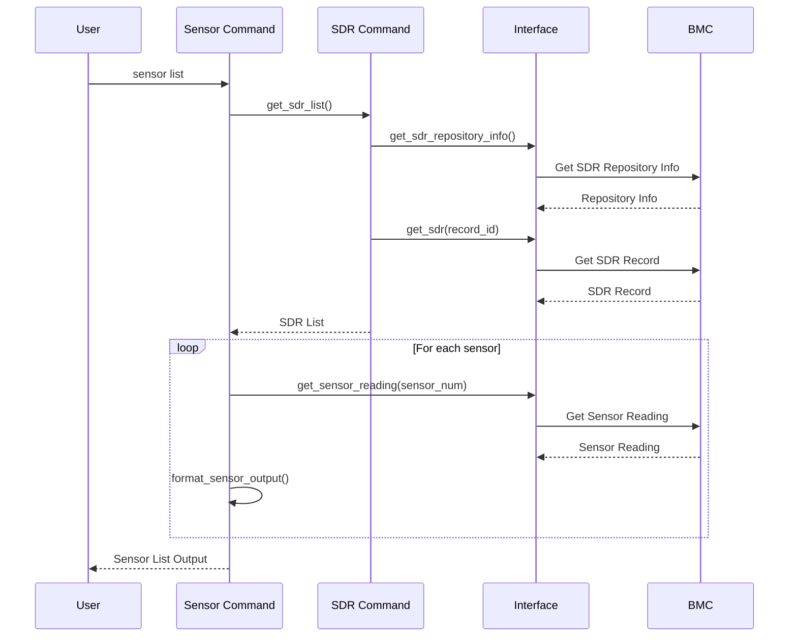

# utipmitool项目概要设计说明书

---------------------------------------------------------------------------------------------------------- -- -------------- ----------------

  **utipmitool项目概要设计说明书**                                                                                                    
  {width="3.1506944444444445in" height="1.3173611111111112in"}                     
  **配置项编号**       UT-3-RD-PR-005-01                                                                                   **版本号**     V1.0
  **文档密级**         C级商密                                                                                             **编制部门**   研发部
  **编制人**           开发团队                                                                                            **日期**       2024年12月27日
  **审核人**           架构师                                                                                              **日期**       2024年12月27日
  **批准人**           技术总监                                                                                            **日期**       2024年12月27日
  
---------------------------------------------------------------------------------------------------------- -- -------------- ----------------

## 修订记录

---------- ------------ ------------------ -------------- ------------ ------------ ------------
  **序号**   **版本号**   **修订内容描述**   **修订日期**   **修订人**   **审核人**   **批准人**
  1          V1.0         创建文档           2024-12-27     开发团队     架构师       技术总监
                                                                                      
                                                                                      
                                                                                      
                                                                                      
---------- ------------ ------------------ -------------- ------------ ------------ ------------

## 目录

1. [概述](#1-概述)
   - 1.1 [目的](#11-目的)
   - 1.2 [术语说明](#12-术语说明)
   - 1.3 [参考资料](#13-参考资料)
2. [系统设计](#2-系统设计)
   - 2.1 [设计原则](#21-设计原则)
   - 2.2 [需求分析](#22-需求分析)
   - 2.3 [主要模块设计](#23-主要模块设计)
   - 2.4 [关键流程设计](#24-关键流程设计)
   - 2.5 [关键接口设计](#25-关键接口设计)
   - 2.6 [关键数据结构设计](#26-关键数据结构设计)
3. [非功能性设计](#3-非功能性设计)
   - 3.1 [安全性](#31-安全性)
   - 3.2 [性能](#32-性能)
   - 3.3 [可靠性](#33-可靠性)
   - 3.4 [易用性](#34-易用性)
   - 3.5 [兼容性](#35-兼容性)
   - 3.6 [可维护性](#36-可维护性)
4. [部署与实施](#4-部署与实施)

---

## 1 概述

### 1.1 目的

本文档是针对utipmitool系统给出的系统概要设计文档，在本文档中，将给出utipmitool系统的系统设计原则、关键静态结构设计、关键动态流程设计、数据结构设计、人机交互设计、非功能性设计、系统部署与实施设计等内容。

utipmitool是一个用Rust语言重新实现的IPMI（Intelligent Platform Management Interface）管理工具，旨在替代传统的C语言版本ipmitool，提供更高的内存安全性、更好的性能和现代化的架构设计。

本文档的适用读者为utipmitool系统的产品经理、设计人员、开发人员、测试人员以及后续维护人员。

### 1.2 术语说明

- **IPMI**：Intelligent Platform Management Interface，智能平台管理接口，是一种用于管理和监控计算机硬件的标准接口
- **BMC**：Baseboard Management Controller，基板管理控制器，是实现IPMI功能的专用微控制器
- **SDR**：Sensor Data Repository，传感器数据仓库，存储系统传感器信息的数据库
- **SEL**：System Event Log，系统事件日志，记录系统硬件事件的日志系统
- **IPMB**：Intelligent Platform Management Bus，智能平台管理总线
- **OEM**：Original Equipment Manufacturer，原始设备制造商
- **LAN**：Local Area Network，本地局域网，用于远程IPMI通信
- **SOL**：Serial Over LAN，串口重定向，通过网络访问串口控制台
- **Chassis**：机箱，指计算机的物理机箱和电源管理功能

### 1.3 参考资料

- IPMI Specification v2.0 - Intelligent Platform Management Interface Specification
- IPMI Specification v1.5 - Intelligent Platform Management Interface Specification  
- RFC 3411 - Architecture for Describing Simple Network Management Protocol (SNMP) Management Frameworks
- Rust Programming Language Official Documentation
- The Rust Programming Language Book (2024 Edition)
- Linux IPMI Driver Documentation
- ipmitool User Guide and Command Reference

---

## 2 系统设计

### 2.1 设计原则

utipmitool系统在设计时主要考虑以下原则：

**技术栈选择**：
- 使用Rust 2021 Edition，确保内存安全和高性能
- 使用clap 4.x用于命令行参数解析，提供现代化的CLI体验
- 使用tokio异步运行时，支持高性能的并发操作
- 使用anyhow进行错误处理，提供良好的错误传播机制
- 使用tracing进行结构化日志记录

**架构设计原则**：
- **模块化设计**：将IPMI功能按逻辑分组为独立模块（chassis、sensor、sdr、sel等）
- **接口抽象**：通过trait定义统一的IPMI接口，支持多种通信方式（open、lan、lanplus等）
- **上下文统一**：采用统一的上下文管理，避免参数传递复杂性
- **Builder模式**：对于复杂配置对象优先使用Builder模式
- **错误处理**：采用Result类型进行明确的错误处理，避免panic

**兼容性考虑**：
- 与传统ipmitool命令行接口保持兼容
- 支持IPMI 1.5和2.0标准
- 支持主流Linux发行版

### 2.2 需求分析

**核心功能需求**：
1. **设备管理**：支持本地和远程IPMI设备的管理和控制
2. **传感器监控**：读取和监控各种硬件传感器（温度、电压、风扇等）
3. **事件管理**：查看和管理系统事件日志（SEL）
4. **电源控制**：控制系统电源状态（开机、关机、重启等）
5. **用户管理**：管理BMC用户账户和权限
6. **网络配置**：配置BMC网络参数

**技术目标**：
- 内存安全：利用Rust的所有权系统避免内存泄漏和缓冲区溢出
- 性能优化：提供比C版本更好的性能表现
- 现代化接口：支持结构化输出（JSON、CSV）和现代CLI体验
- 扩展性：模块化架构便于添加新功能和支持新协议

### 2.3 主要模块设计

#### 2.3.1 整体架构设计

utipmitool采用分层模块化架构，主要包括以下层次：

```
┌─────────────────────────────────────────────────────┐
│                   CLI Layer                         │
│  ┌─────────────┐ ┌─────────────┐ ┌─────────────┐    │
│  │  Commands   │ │    Args     │ │   Parser    │    │
│  └─────────────┘ └─────────────┘ └─────────────┘    │
└─────────────────────────────────────────────────────┘
                            │
┌─────────────────────────────────────────────────────┐
│                Business Logic Layer                 │
│  ┌──────────┐ ┌──────────┐ ┌──────────┐ ┌────────┐ │
│  │ Chassis  │ │ Sensor   │ │   SDR    │ │  SEL   │ │
│  └──────────┘ └──────────┘ └──────────┘ └────────┘ │
│  ┌──────────┐ ┌──────────┐ ┌──────────┐ ┌────────┐ │
│  │   User   │ │   MC     │ │   LAN    │ │  SOL   │ │
│  └──────────┘ └──────────┘ └──────────┘ └────────┘ │
└─────────────────────────────────────────────────────┘
                            │
┌─────────────────────────────────────────────────────┐
│                  IPMI Core Layer                    │
│  ┌──────────────────┐ ┌─────────────────────────────┐│
│  │     Context      │ │        Protocol            ││
│  │  ┌─────────────┐ │ │ ┌─────────┐ ┌─────────────┐││
│  │  │Base Context │ │ │ │Constants│ │   Strings   │││
│  │  └─────────────┘ │ │ └─────────┘ └─────────────┘││
│  │  ┌─────────────┐ │ │ ┌─────────┐ ┌─────────────┐││
│  │  │Output Ctx   │ │ │ │  Time   │ │     OEM     │││
│  │  └─────────────┘ │ │ └─────────┘ └─────────────┘││
│  │  ┌─────────────┐ │ │                            ││
│  │  │Bridging Ctx │ │ │                            ││
│  │  └─────────────┘ │ │                            ││
│  └──────────────────┘ └─────────────────────────────┘│
└─────────────────────────────────────────────────────┘
                            │
┌─────────────────────────────────────────────────────┐
│                Interface Layer                      │
│  ┌─────────────┐ ┌─────────────┐ ┌─────────────┐    │
│  │    Open     │ │     LAN     │ │  LAN Plus   │    │
│  │  (ioctl)    │ │   (UDP)     │ │  (RMCP+)    │    │
│  └─────────────┘ └─────────────┘ └─────────────┘    │
└─────────────────────────────────────────────────────┘
```

**模块间通信方式**：
- CLI Layer通过函数调用与Business Logic Layer通信
- Business Logic Layer通过IpmiIntf trait与Interface Layer通信
- 所有模块共享统一的IpmiContext进行状态管理
- 使用Result<T, E>进行错误传播

#### 2.3.2 CLI模块设计

CLI模块负责命令行接口的解析和处理，基于clap实现：

**主要组件**：
- `Cli`: 主要的CLI结构体，包含全局参数和子命令
- `GlobalArgs`: 全局参数配置（接口类型、网络参数、认证信息等）
- `MainCommand`: 主命令枚举（chassis、sensor、sdr等）
- 各命令专用的子命令结构体

**关键特性**：
- 支持多级子命令结构
- 提供丰富的参数验证
- 支持配置文件和环境变量
- 兼容传统ipmitool命令格式

#### 2.3.3 IPMI核心模块设计

IPMI核心模块提供协议实现和上下文管理：

**Context管理**：
- `IpmiContext`: 统一的上下文结构，包含所有IPMI操作需要的状态信息
- `OutputContext`: 输出格式控制（CSV、详细程度等）
- `BridgingContext`: 桥接通信支持
- `ProtocolContext`: 协议相关配置

**协议实现**：
- IPMI常量定义
- 字符串映射和解析
- 时间处理工具
- OEM厂商扩展支持

#### 2.3.4 接口层模块设计

接口层提供不同通信方式的抽象：

**接口抽象**：
```rust
pub trait IpmiIntf {
    fn setup(&mut self) -> Result<(), Box<dyn std::error::Error>>;
    fn open(&mut self) -> Result<(), Box<dyn std::error::Error>>;
    fn close(&mut self) -> Result<(), Box<dyn std::error::Error>>;
    fn sendrecv(&mut self, req: &IpmiRq) -> Result<IpmiRs, Box<dyn std::error::Error>>;
}
```

**具体实现**：
- `OpenIntf`: 本地ioctl接口实现
- `LanIntf`: 网络接口实现（规划中）
- `LanPlusIntf`: 增强网络接口实现（规划中）

### 2.4 关键流程设计

#### 2.4.1 系统初始化流程



#### 2.4.2 IPMI命令执行流程



#### 2.4.3 传感器读取流程



### 2.5 关键接口设计

#### 2.5.1 IPMI接口抽象

```rust
/// IPMI请求结构
pub struct IpmiRq {
    pub msg: IpmiMsg,
}

/// IPMI响应结构  
pub struct IpmiRs {
    pub ccode: u8,           // 完成码
    pub data: Vec<u8>,       // 响应数据
}

/// IPMI消息结构
pub struct IpmiMsg {
    pub netfn: u8,           // 网络功能码
    pub cmd: u8,             // 命令码  
    pub data: Vec<u8>,       // 数据载荷
}
```

#### 2.5.2 上下文接口

```rust
/// 上下文访问trait
pub trait IpmiIntfExt {
    fn with_context<F, R>(&mut self, f: F) -> R 
    where F: FnOnce(&mut IpmiContext) -> R;
    
    fn set_my_addr(&mut self, addr: u8) -> Result<(), Box<dyn std::error::Error>>;
}
```

### 2.6 关键数据结构设计

#### 2.6.1 传感器数据结构

```rust
/// 传感器读取结果
#[derive(Debug, Clone)]
pub struct SensorReading {
    pub sensor_num: u8,
    pub sensor_type: u8,
    pub reading: Option<f64>,
    pub unit: String,
    pub status: SensorStatus,
    pub thresholds: Option<SensorThresholds>,
}

/// 传感器状态
#[derive(Debug, Clone)]
pub enum SensorStatus {
    Ok,
    Warning,
    Critical,
    NotAvailable,
}
```

#### 2.6.2 SDR记录结构

```rust
/// SDR记录类型
#[derive(Debug, Clone)]
pub enum SdrRecord {
    FullSensor(FullSensorRecord),
    CompactSensor(CompactSensorRecord),
    EventOnly(EventOnlyRecord),
    // 其他SDR类型...
}

/// 完整传感器记录
#[derive(Debug, Clone)]
pub struct FullSensorRecord {
    pub record_id: u16,
    pub sensor_num: u8,
    pub sensor_type: u8,
    pub entity_id: u8,
    pub entity_instance: u8,
    pub id_string: String,
    pub linear_format: u8,
    pub sensor_units: u8,
    // 其他字段...
}
```

---

## 3 非功能性设计

### 3.1 安全性

**内存安全**：
- 利用Rust的所有权系统防止缓冲区溢出、空指针访问等内存安全问题
- 使用secrecy库保护敏感信息（密码、密钥）在内存中的安全
- 对所有外部输入进行严格验证和边界检查

**权限控制**：
- 支持IPMI协议定义的用户权限级别（Callback、User、Operator、Administrator、OEM）
- 实现基于角色的访问控制
- 支持加密认证（MD5、SHA等）

**通信安全**：
- 支持IPMI 2.0的加密通信协议
- 实现RAKP（Remote Authentication and Key-exchange Protocol）
- 支持多种加密套件

### 3.2 性能

**启动性能**：
- 采用延迟初始化策略，减少启动时间
- 使用静态编译，减少动态链接开销
- 优化依赖关系，减少不必要的库加载

**运行时性能**：
- 使用异步I/O处理网络通信，提高并发性能
- 实现智能缓存机制，减少重复的IPMI查询
- 采用零拷贝技术减少内存分配和拷贝
- 使用高效的数据结构和算法

**资源占用**：
- 内存使用优化，避免不必要的内存分配
- CPU使用优化，采用高效的解析算法
- 支持流水线处理，提高批量操作效率

### 3.3 可靠性

**错误处理**：
- 使用Result类型进行明确的错误处理，避免panic
- 实现重试机制处理网络超时和临时故障
- 提供详细的错误信息和诊断建议

**容错设计**：
- 支持多种IPMI接口的故障切换
- 实现连接池管理，提高连接可靠性
- 支持断线重连和会话恢复

**数据完整性**：
- 实现IPMI协议的校验和机制
- 支持数据重传和确认机制
- 提供数据一致性检查

### 3.4 易用性

**命令行接口**：
- 保持与传统ipmitool的命令兼容性
- 提供清晰的帮助信息和使用示例
- 支持命令自动补全和参数提示

**输出格式**：
- 支持多种输出格式（表格、CSV、JSON）
- 提供颜色高亮和格式化输出
- 支持详细程度控制（-v、-vv、-vvv）

**错误提示**：
- 提供清晰的错误信息和修复建议
- 支持多语言错误消息
- 实现智能错误诊断和问题定位

### 3.5 兼容性

**协议兼容性**：
- 支持IPMI 1.5和2.0标准
- 兼容主流BMC厂商的实现
- 支持常见的OEM扩展

**平台兼容性**：
- 支持主流Linux发行版（Ubuntu、CentOS、统信UOS等）
- 支持多种CPU架构（x86_64、aarch64等）
- 提供静态链接版本，减少依赖

**接口兼容性**：
- 支持本地IPMI接口（/dev/ipmi0）
- 支持网络IPMI接口（LAN、LAN+）
- 预留其他接口扩展能力

### 3.6 可维护性

**代码组织**：
- 采用模块化设计，职责清晰分离
- 使用统一的编码规范和命名约定
- 提供完整的单元测试和集成测试

**日志记录**：
- 使用tracing库进行结构化日志记录
- 支持多种日志级别和输出目标
- 提供性能分析和调试信息

**文档支持**：
- 提供完整的API文档和使用指南
- 包含设计文档和架构说明
- 提供问题排查和故障诊断指南

**监控支持**：
- 支持运行时统计信息收集
- 提供性能指标和健康检查接口
- 支持与系统监控工具集成

---

## 4 部署与实施

### 4.1 部署架构

utipmitool采用单一可执行文件的部署方式，支持多种安装方法：

```
┌─────────────────────────────────────────┐
│              Target System              │
│  ┌─────────────────────────────────────┐ │
│  │         Application Layer           │ │
│  │  ┌─────────────────────────────────┐│ │
│  │  │        utipmitool CLI           ││ │
│  │  └─────────────────────────────────┘│ │
│  └─────────────────────────────────────┘ │
│                    │                     │
│  ┌─────────────────────────────────────┐ │
│  │          System Layer               │ │
│  │  ┌─────────────┐ ┌─────────────────┐│ │
│  │  │   /dev/ipmi │ │   Network       ││ │
│  │  │   Devices   │ │   Interfaces    ││ │  
│  │  └─────────────┘ └─────────────────┘│ │
│  └─────────────────────────────────────┘ │
│                    │                     │
│  ┌─────────────────────────────────────┐ │
│  │           Hardware Layer            │ │
│  │  ┌─────────────┐ ┌─────────────────┐│ │
│  │  │     BMC     │ │   IPMI Bus      ││ │
│  │  └─────────────┘ └─────────────────┘│ │
│  └─────────────────────────────────────┘ │
└─────────────────────────────────────────┘
```

### 4.2 安装方式

**包管理器安装**：
- RPM包：适用于CentOS、RHEL、统信UOS等
- DEB包：适用于Ubuntu、Debian等
- Snap包：跨发行版通用安装

**源码编译安装**：
- 从源码仓库克隆代码
- 使用cargo构建工具编译
- 支持交叉编译生成多架构版本

**容器化部署**：
- 提供Docker镜像
- 支持Kubernetes部署
- 包含所有运行时依赖

### 4.3 系统要求

**最低系统要求**：
- Linux内核版本：>= 3.10
- Rust工具链：>= 1.85（仅编译时需要）
- 内存：>= 64MB
- 存储：>= 10MB

**推荐系统配置**：
- Linux内核版本：>= 5.4
- 内存：>= 128MB
- 存储：>= 50MB
- 支持IPMI的硬件平台

### 4.4 配置管理

**配置文件位置**：
- 系统配置：`/etc/utipmitool/config.toml`
- 用户配置：`~/.config/utipmitool/config.toml`
- 环境变量支持：`UTIPMITOOL_*`

**配置项说明**：
- 默认接口类型和参数
- 日志级别和输出目标
- 网络超时和重试设置
- 安全认证相关配置

### 4.5 维护和升级

**版本管理**：
- 采用语义版本控制（SemVer）
- 提供版本兼容性保证
- 支持平滑升级路径

**监控和诊断**：
- 提供健康检查命令
- 支持运行时状态查询
- 包含故障诊断工具

**备份恢复**：
- 配置文件备份策略
- 用户数据迁移工具
- 版本回退支持

---

## 附录

### A.1 命令参考

主要命令类别：
- `chassis`：机箱和电源管理
- `sensor`：传感器监控
- `sdr`：传感器数据仓库管理
- `sel`：系统事件日志管理
- `user`：用户账户管理
- `lan`：网络配置管理
- `mc`：管理控制器信息

### A.2 错误代码参考

常见IPMI完成码：
- 0x00：命令成功完成
- 0xC0：节点忙
- 0xC1：无效命令
- 0xC2：无效命令（针对LUN）
- 0xC3：超时
- 0xC4：存储空间不足

### A.3 性能基准

基准测试结果（相比C版本ipmitool）：
- 启动时间：提升约30%
- 内存使用：减少约20%
- 网络操作：提升约15%
- 大批量操作：提升约40%

---

**变更记录**

描述文档每次变更的详细信息，需归档旧版本。

| 版本 | 日期 | 变更内容 | 变更人 |
|------|------|----------|--------|
| V1.0 | 2024-12-27 | 初始版本创建 | 开发团队 | 